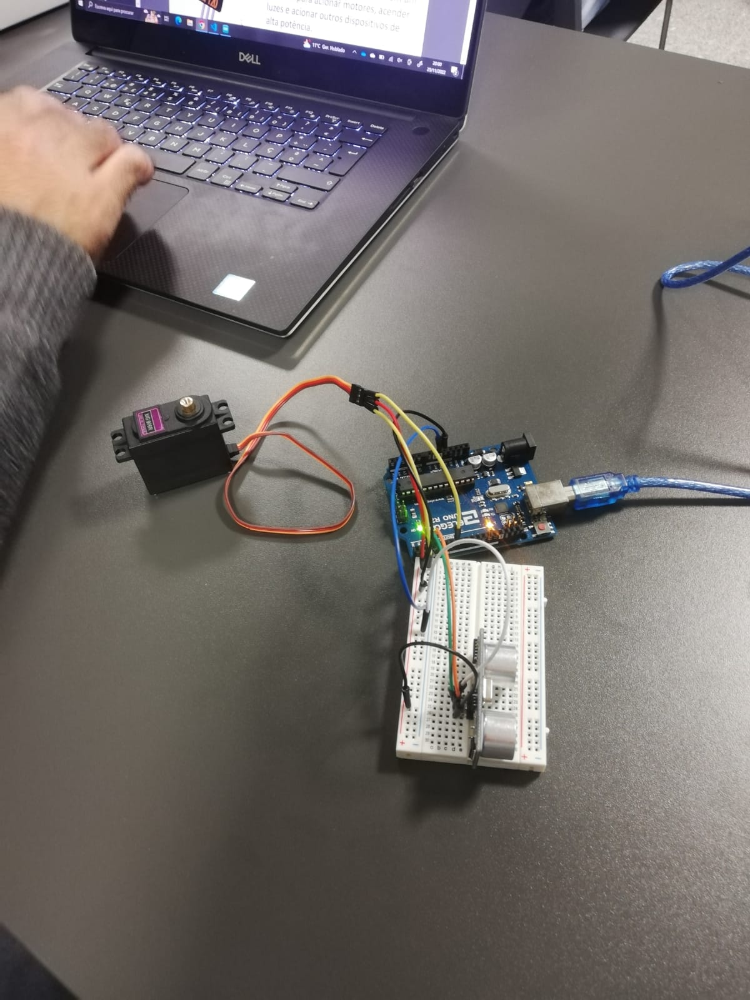
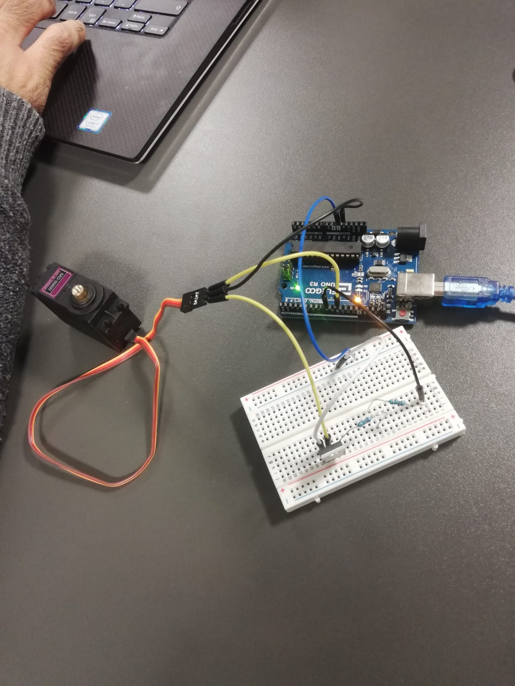

# setr22
Aula 5 - Prática 

## Exercício 1
Controlar a posição de rotação com um servo

## Exercício 2
Controlar a velocidade de servos de rotação contínua

## Exercício 3
Controlar servo motor através de sensor de proximidade ultrassónico

## Exercício 4
Controlar servo com transístor Darlington TIP120

